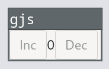

# van-gtk = vanjs + gtk4

A library lets you create GUI with [vanjs](https://vanjs.org) and [gjs](https://gjs.guide/guides/gtk/3/03-installing.html#installing-gjs) in a reactive way.


## Hello World




1. You should have installed [gjs](https://gjs.guide/guides/gtk/3/03-installing.html#installing-gjs).
Example for Archlinux
    ```sh
    sudo pacman -S gjs
    ```
1. Create a npm project
    ```sh
    npm init
    ```

1. Install dependencies
    ```sh
    npm install van-gtk
    npm install -D esbuild
    ```

1. Create index.js
    ```javascript
    import Gtk from 'gi://Gtk?version=4.0';
    import { app, Button, Box, Label, van } from 'van-gtk'
    app(()=>{
      const count = van.state(0)
        const win = new Gtk.Window({
          child: Box(
            Button({
              label: "Inc",
              onclicked: () => {
                count.val++;
              }
            }),
            count,
            Button({
              label: "Dec",
              onclicked: () => {
                count.val--;
              }
            }),
        )});
        return win;
    })
    .exitOnClose()
    .run()
    ```


1. Create esbuild.mjs
    ```javascript
    
    import { build } from "esbuild";
    
    await build({
        entryPoints: ['index.js'],
        outdir: 'dist',
        bundle: true,
        target: "firefox115", // Since GJS 1.77.2
        format: 'esm',
        external: ['gi://*', 'resource://*', 'gettext', 'system', 'cairo'],
    })
    ```

1. Build
    ```sh
    node esbuild.mjs
    ```

1. Run
    ```sh
    gjs -m dist/main.js
    ```
